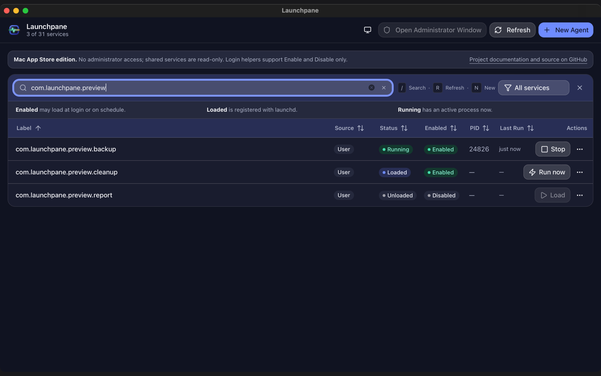

<p align="center">
  
</p>

<p align="center">
  <strong>Know what starts on your Mac.</strong><br>
  A native macOS app for managing launch agents, daemons, and login items.
</p>

<p align="center">
  <a href="https://github.com/webmaxru/Launchpane/actions/workflows/ci.yml"></a>
  <a href="https://github.com/webmaxru/Launchpane/actions/workflows/release.yml"></a>
  <a href="https://github.com/webmaxru/Launchpane/actions/workflows/pages.yml"></a>
  <a href="https://github.com/webmaxru/Launchpane/releases/latest"></a>
  <a href="LICENSE"></a>
  
  
</p>

<p align="center">
  <a href="https://github.com/webmaxru/Launchpane/releases/latest"><strong>Download</strong></a> ·
  <a href="https://salnikov.no/Launchpane/">Website</a> ·
  <a href="https://salnikov.no/Launchpane/support/">Support</a> ·
  <a href="https://salnikov.no/Launchpane/privacy/">Privacy</a>
</p>

<p align="center">
  
</p>

Browse user LaunchAgents (`~/Library/LaunchAgents/`), system agents/daemons, and app login items. Start, stop, restart, view/edit plist files, and create new agents. Built with Tauri v2.

## Features

- List User Agents (`~/Library/LaunchAgents/`), System Agents, System Daemons, and Login Items
- Search by label and filter by source (User / Home / System / Daemon / Login Items)
- Load / Run now / Stop (Unload) / Restart / Enable / Disable for user and shared GUI agents; administrator controls for system daemons
- Create new agents, edit and delete existing ones
- Schedule configuration (interval / calendar) with next run time preview
- View stdout / stderr logs
- Inspect plist configuration details
- Reveal plist file in Finder

In the standalone build, `/Library/LaunchAgents` can be controlled in the current
user's GUI session without root. `/Library/LaunchDaemons` require **Open
Administrator Window**. Shared system plist files remain protected from editing
and removal, including in administrator mode.

Login Items are the background helpers that apps register with macOS ServiceManagement
(`<App>.app/Contents/Library/LoginItems/<Helper>.app`). They have no plist file of their own, so the
supported actions are Enable / Disable and, while registered, Run now / Restart /
Unload. Load, Edit and Remove are hidden. Unloading requires confirmation because
only the parent app can register the helper again; Enable alone does not reload
it. A parent app may re-register its helper the next time it launches.

See the [standalone action availability tables](docs/native-actions.md) for every
action's privilege requirements, state dependencies, reasons for disabling or
hiding it, and real-Mac verification limits. Enable does not load or start;
Disable does not stop an already loaded service.

The Mac App Store edition has no administrator access: shared agents and daemons
are read-only, and login helpers retain Enable/Disable only. Edition-specific
limits stay visible with explanations and a project documentation/source link.
See the [App Store action and review-policy tables](docs/app-store-actions.md).

## Install

Download the latest [signed release](https://github.com/webmaxru/Launchpane/releases/latest).
Standalone builds from **v1.2.2** are signed with Developer ID and notarized
by Apple.

Choose the Apple Silicon (`aarch64`), Intel (`x64`), or Universal DMG, open it,
and drag Launchpane to Applications. Follow the normal macOS installation
prompts—do not remove quarantine attributes.

App archives are also available, including `Launchpane_universal.app.tar.gz`.
Each release includes `SHA256SUMS` for all six downloads. Standalone builds
are separate from the sandboxed Mac App Store edition. The older v1.2.1
assets remain unsigned and are not replaced.

## Product website

The [Launchpane website](https://salnikov.no/Launchpane/) is hosted on
this repository's GitHub Pages. Source pages and assets live in `docs/`.

- `pnpm site:test` checks the dependency-free website builder.
- `pnpm site:build` validates local links, assets, and anchors, then writes
  the deployable site to `dist/site/`.
- `pnpm site:assets` regenerates the favicon, touch/PWA icons, and the 1200×630
  social card (`docs/assets/og-image.png`) from `branding/`. It needs macOS
  and Google Chrome or Microsoft Edge. Edit the card in
  `branding/social/og.html`.

**Publish product pages** builds website changes on pull requests without
deploying them. Changes merged into `main` build and deploy automatically;
the workflow can also be run manually. GitHub Pages must be enabled with
**GitHub Actions** as its source in repository settings. The workflow uses
the `github-pages` environment and deploys only after the build succeeds.

## GitHub release pipeline

The repository includes the Copilot agent skill
[`release-up`](.github/skills/release-up/SKILL.md). Prompt **"release up"** to
coordinate standalone and Store release preparation. It resolves patch/minor/
major or same-version retries, pins both channels to one source/version, and
checks credentials, native assets, signing and review gates. Store upload,
App Review submission and public availability are separate stages; a generic
release request does not authorize review submission or guarantee simultaneous
availability. Creating the skill does not itself trigger a release.

Pushing a `v<version>` tag runs **Standalone release**. The tag must match
`package.json`, both Rust version records, and `src-tauri/tauri.conf.json`.
The pipeline checks the frontend and both backend editions, then builds
Apple Silicon, Intel, and Universal standalone apps and DMGs. It verifies
bundle versions, CPU architectures, license inclusion, and DMG integrity,
imports a Developer ID certificate into a temporary keychain, signs with
Hardened Runtime, notarizes and staples the apps and DMGs, verifies
Gatekeeper acceptance, packages the `.app` archives, and generates SHA-256
checksums. It fails rather than silently publishing unsigned or unstapled
artifacts.

Only after all builds succeed does it upload all seven assets to a draft
GitHub release and publish it as latest. A failed build publishes nothing;
a failed upload leaves a draft, never a partial public release.

### Configure macOS distribution credentials

Before running a signed release, create a **Developer ID Application**
certificate in the Apple Developer account, export its certificate and private
key as a password-protected `.p12`, and create an App Store Connect API key
with access to submit software for notarization. The separate **Developer ID
Installer** certificate is not needed for the app archives and DMGs.

In GitHub **Settings → Environments**, configure the `macos-distribution`
environment with these secrets:

| Secret | Value |
| --- | --- |
| `DEVELOPER_ID_CERTIFICATE_BASE64` | Base64-encoded Developer ID Application `.p12`, including its private key |
| `DEVELOPER_ID_CERTIFICATE_PASSWORD` | Password used when exporting the `.p12` |
| `APPLE_SIGNING_IDENTITY` | Full `Developer ID Application: … (TEAMID)` identity shown by `security find-identity -v -p codesigning` |
| `APPLE_API_KEY` | App Store Connect API key ID |
| `APPLE_API_ISSUER` | App Store Connect issuer ID |
| `APPLE_API_PRIVATE_KEY_BASE64` | Base64-encoded API `.p8` private key |

Protect these secrets; never commit them or paste them into source files.
Each macOS build runner imports the certificate into a temporary keychain,
writes the API key to a temporary file, and removes both after the build.
The workflow checks the imported identity, signed app, notarization tickets,
stapling, and Gatekeeper assessments before it uploads anything. A missing
secret or failed Apple notarization stops the release before publication.

The older **v1.2.1** release predates the signing credentials and remains
unsigned and unnotarized; it is not silently replaced. Releases from **v1.2.2**
onward are signed and notarized. App Store distribution continues to use its
separate manual workflow and credentials.

To publish a subsequent version, configure the distribution secrets above,
bump the synchronized versions, commit all intended app changes, push the
commit, and push its matching version tag.
The workflow also supports manual dispatch with an existing tag. If a failed
publication left a draft, inspect and delete that draft before retrying;
the workflow does not overwrite existing releases.

**Publish to Mac App Store** is manual-only and is not triggered by standalone
tags. Its signing, upload, and review requirements remain separate.

## Tech Stack

- Tauri v2 (Rust backend) + React + TypeScript + Vite
- UI: Tailwind CSS v4 + shadcn/ui
- Lint: oxlint (TypeScript), cargo clippy + rustfmt (Rust)
- Test: vitest (Frontend), cargo test (Rust)
- Package manager: pnpm

## Development

```bash
# Install dependencies
pnpm install

# Dev mode (launches app with hot reload)
pnpm tauri:dev

# Frontend only
pnpm dev

# Production build (DMG)
pnpm tauri:build
```

### Building a launchable `.app`

To get a double-clickable app bundle instead of the hot-reload dev window:

```bash
# Rebuild the release .app on every source change (recommended)
pnpm app:watch

# Build the release .app once
pnpm app:build

# Open the most recent release bundle
pnpm app:open
```

`pnpm app:watch` watches `src/`, `src-tauri/src/`, `src-tauri/capabilities/`,
`src-tauri/Cargo.toml`, `src-tauri/tauri.conf.json`, `index.html`,
`vite.config.ts` and `tsconfig.json`. Changes are debounced, builds are
serialized, and `*.test.*` / `*.spec.*` files are ignored. The bundle is
written to:

```
src-tauri/target/release/bundle/macos/Launchpane.app
```

Quit and relaunch the app to pick up a new build — the bundle is replaced in
place, so a running instance keeps the old code.

The default commands above already build the optimized release bundle. For
debug builds, use:

```bash
pnpm app:build:debug
pnpm app:watch:debug
```

Do not run `pnpm tauri:dev` at the same time as `pnpm app:watch` — both drive
`cargo` against `src-tauri/target`, and they will block on the same build lock.

## Testing / Lint

```bash
pnpm test          # vitest (frontend)
pnpm lint          # oxlint
pnpm typecheck     # TypeScript type check

cargo test --manifest-path src-tauri/Cargo.toml          # Rust tests
cargo fmt --manifest-path src-tauri/Cargo.toml --check   # Rust format check
cargo clippy --manifest-path src-tauri/Cargo.toml -- -D warnings  # Rust lint
```

## Brand & App Store assets

App icon, wordmark and the Mac App Store graphics package live in [`branding/`](branding/).
See [`branding/README.md`](branding/README.md) for the palette, deliverables and the
submission checklist.

```bash
pnpm store:icons        # regenerate src-tauri/icons from the master artwork
pnpm store:screenshots  # render all accepted Mac App Store screenshot sizes
pnpm appstore:verify    # validate copy, versions, icons, and screenshots
pnpm appstore:prepare   # assemble Fastlane metadata and graphics
```

The complete credential-driven publishing flow is documented in
[`appstore/README.md`](appstore/README.md). The **Publish to Mac App Store**
workflow builds a universal binary, embeds the provisioning profile, signs the
app and installer, validates them with Apple, uploads all metadata and
screenshots, and can submit the version for review.

## License

Launchpane is released under the [MIT License](LICENSE), which is shipped inside
the application bundle at `Contents/Resources/LICENSE`.
